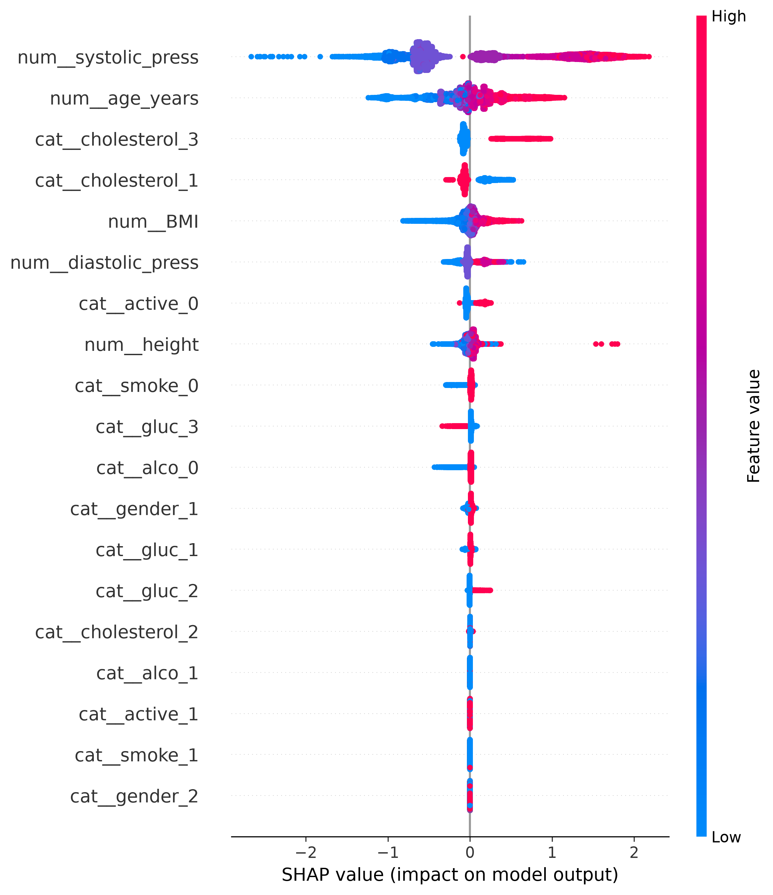
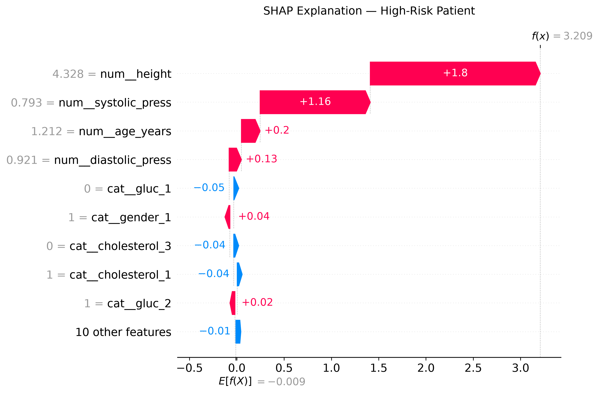
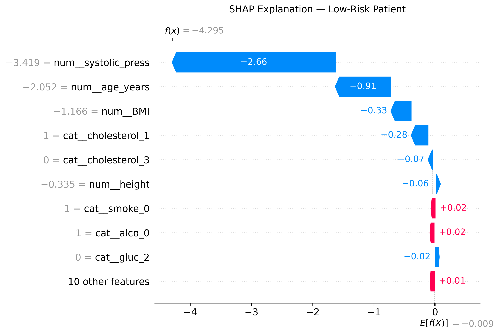

# Cardiovascular Disease Risk Prediction

A machine learning project predicting cardiovascular disease risk from clinical and lifestyle patient data, combining a biomedical engineering background with applied ML techniques - from data cleaning to model interpretability.

## Project Overview

This project applies and compares multiple machine learning algorithms to predict whether a patient is likely to develop cardiovascular disease, based on clinical measurements (blood pressure, cholesterol, glucose) and lifestyle factors (smoking, alcohol, physical activity).

The dataset and problem were chosen deliberately: they connect to my professional background in cardiac rhythm management (Biotronik) and my 2021 publication on machine learning applied to cardiac imaging (SPECT), allowing me to combine domain knowledge with a hands-on ML implementation.

**Key result:** three different algorithms (Logistic Regression, Random Forest, XGBoost) converge to a similar performance ceiling (AUC ≈ 0.79–0.80), suggesting the main limiting factor is the information available in basic clinical features rather than model complexity - a finding further confirmed by testing a stacking ensemble.

## Dataset

- **Source:** [Cardiovascular Disease dataset](https://www.kaggle.com/datasets/sulianova/cardiovascular-disease-dataset) (Kaggle, open-source)
- **Size:** ~70,000 patient records, ~68,000 after cleaning
- **Features:** age, gender, height, weight, blood pressure (systolic/diastolic), cholesterol, glucose, smoking, alcohol intake, physical activity
- **Target:** presence (1) or absence (0) of cardiovascular disease

## Methodology

1. **EDA & Data Cleaning** - identified and removed physiologically implausible values (e.g., negative or extreme blood pressure, inconsistent systolic/diastolic values, unrealistic height/weight) - ~3.7% of records removed overall
2. **Feature Engineering** - derived BMI from height and weight; dropped `weight` due to high collinearity with BMI (0.86)
3. **Preprocessing** - `ColumnTransformer` pipeline with scaling (numerical features) and one-hot encoding (categorical features), preventing data leakage via proper train/test split before fitting
4. **Model Comparison** - Logistic Regression, Random Forest, and XGBoost, each evaluated at baseline and after hyperparameter tuning (`GridSearchCV`, 5-fold cross-validation, optimized for ROC-AUC)
5. **Threshold Tuning** - given the clinical context, recall on the positive class was prioritized over raw accuracy, since a false negative (missing a true at-risk patient) carries a higher cost than a false alarm
6. **Stacking Ensemble** - tested combining all three tuned models; did not outperform individual models, confirming they capture largely overlapping patterns
7. **Interpretability (SHAP)** - applied to the final XGBoost model to explain both global feature importance and individual predictions

## Results

| Model | Accuracy | Recall (class 1) | AUC |
|---|---|---|---|
| Logistic Regression | 0.73 | 0.67 | 0.79 |
| Random Forest (tuned) | 0.73 | 0.67 | 0.80 |
| XGBoost (tuned) | 0.74 | 0.68 | 0.80 |
| Stacking Ensemble | 0.74 | 0.69 | 0.80 |

**SHAP Summary Plot** - global feature importance across the dataset:



**Individual predictions** - high-risk vs. low-risk patient explanation:

| High-Risk Patient | Low-Risk Patient |
|---|---|
|  |  |

## Key Takeaways

- **Systolic blood pressure, age, and cholesterol level** emerged as the strongest predictors of cardiovascular disease risk — consistent with established clinical knowledge, reinforcing confidence in data quality and model behavior
- **Lifestyle features (smoking, alcohol, physical activity) had comparatively minor impact**, likely due to the limitations of self-reported data
- **Model complexity did not translate into better performance**: a simple, interpretable Logistic Regression performed nearly on par with more complex ensemble methods — an important, realistic finding often overlooked in favor of chasing marginal accuracy gains

## Limitations

- The dataset relies on self-reported patient data, introducing noise (reflected in the outliers identified during cleaning)
- Only basic clinical and lifestyle features were available; more advanced clinical markers (e.g., ECG, imaging data) could likely improve predictive performance further
- Results are based on a single open-source dataset and have not been validated on external clinical data

## Tech Stack

Python · pandas · NumPy · scikit-learn · XGBoost · SHAP · matplotlib · seaborn 

## How to Run

```bash
git clone https://github.com/<vinxsan>/cardiovascular-disease-prediction.git
cd cardiovascular-disease-prediction
pip install -r requirements.txt
jupyter notebook cardiovascular_disease_prediction.ipynb
```

## Repository Structure

```
├── cardiovascular_disease_prediction.ipynb   # main notebook
├── images/                                   # saved plots for the README
│   ├── shap_summary_xgb.png
│   ├── shap_waterfall_high_risk.png
│   └── shap_waterfall_low_risk.png
├── requirements.txt
└── README.md
```

## About Me

I'm a Biomedical Engineer transitioning into AI/Machine Learning, currently based in the Netherlands. My background combines 5 years of experience in the medical device industry (cardiac rhythm management and digestive endoscopy) with a strong foundation in ML, including a Master's thesis on Parkinson's disease classification and a 2021 publication on machine learning applied to cardiac imaging. This project is part of my learning path into applied AI/ML roles.

[LinkedIn](https://www.linkedin.com/in/vincenzo-sannino-5256181b1/)
